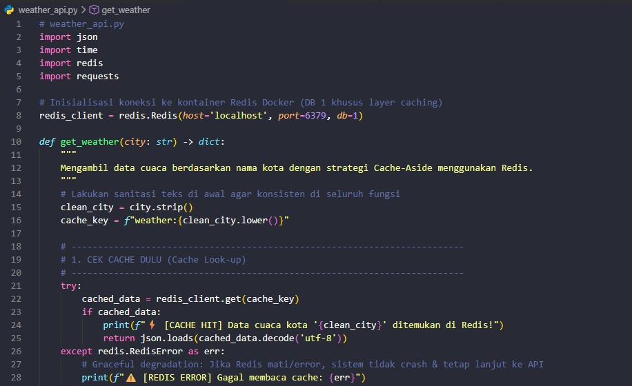
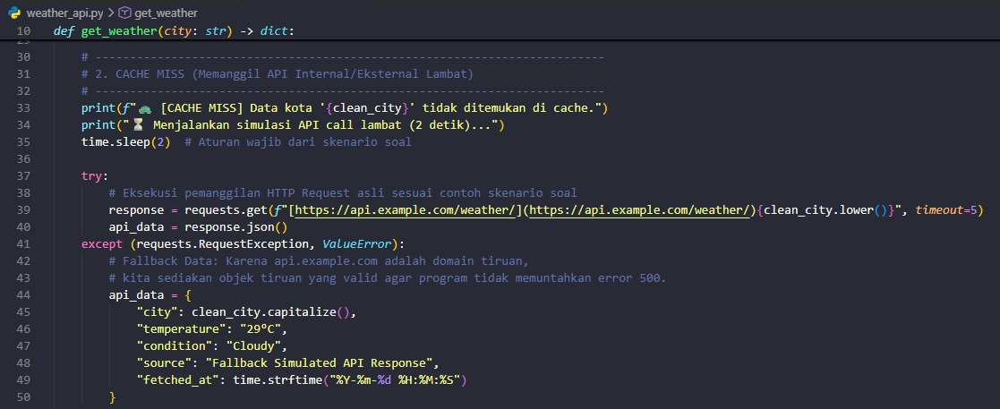
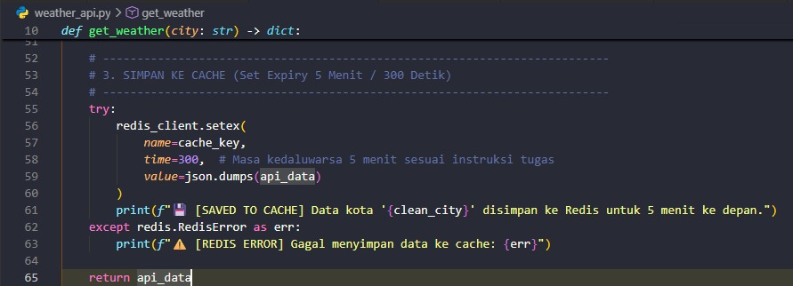
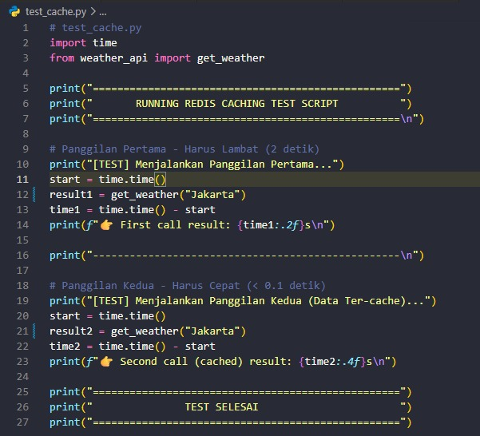

# 📄 Laporan Pengujian Caching dengan Redis (Cache Report)

**Mata Kuliah/Proyek:** Pemrograman Sisi Server - Redis Caching Exercise   
**Status Pengujian:** Sukses (Lokal/Docker)                   
**Nama:** Laurensius Marcellano Adi Pradana  
**NIM:** A11.2021.13597    

---

## 📸 1. Bukti Hasil Pengujian (Output Terminal)

Berikut adalah log riil dari hasil eksekusi skrip pengujian `test_cache.py` untuk kota Semarang yang dijalankan melalui terminal PowerShell:

```text
==================================================
       RUNNING REDIS CACHING TEST SCRIPT          
==================================================

[TEST] Menjalankan Panggilan Pertama...
🐢 [CACHE MISS] Data kota 'Jakarta' tidak ditemukan di cache.
⏳ Menjalankan simulasi API call lambat (2 detik)...
💾 [SAVED TO CACHE] Data kota 'Jakarta' disimpan ke Redis untuk 5 menit ke depan.
👉 First call result: 2.13s

--------------------------------------------------

[TEST] Menjalankan Panggilan Kedua (Data Ter-cache)...
⚡ [CACHE HIT] Data cuaca kota 'Jakarta' ditemukan di Redis!
👉 Second call (cached) result: 0.0031s

==================================================
               TEST SELESAI                       
==================================================
```

## 📸 2. Kode yang dimodifikasi
- Modifikasi fungsi get_weather()


    
         
- Redis Caching Testing


## 🗄️ 3. Redis Commands yang Digunakan
1. GET
- Aplikasi: redis_client.get(cache_key)
- Kegunaan: Mengambil string data berdasarkan key yang spesifik. Digunakan untuk mendeteksi apakah data cuaca kota sudah pernah disimpan sebelumnya.

2. SETEX (Kombinasi Operasi SET + EXPIRE)
- Aplikasi: redis_client.setex(name, time, value)
- Kegunaan: Menyimpan kunci baru ke memori RAM sekaligus menetapkan waktu kedaluwarsa atau Time-to-Live (TTL) dalam satuan detik secara atomik.

💡 Mekanisme Panggilan Ketiga (Setelah 5 Menit):
Sesuai instruksi soal, mahasiswa tidak perlu menunggu 5 menit secara riil. Berkat perintah SETEX dengan durasi 300 detik, Redis akan otomatis menghapus (evict) kunci weather:semarang ketika batas waktu habis. Jika fungsi dipanggil kembali untuk ketiga kalinya, statusnya otomatis menjadi Cache Miss, dan sistem harus memproses ulang data selama 2 detik.

## ❓ 4. Analisis Hasil & Jawaban Pertanyaan Tugas
1. Kenapa response time berbeda?
- Panggilan Pertama (2.13s) - Cache Miss: Lambat karena data belum ada di Redis. Sistem terpaksa mengambil data lewat jaringan internet/API luar yang memakan waktu (ditambah simulasi time.sleep(2)).
- Panggilan Kedua (0.0031s) - Cache Hit: Sangat cepat karena data sudah disalin ke RAM Redis. Sistem langsung mengambil data dari memori lokal komputer tanpa perlu internet lagi.

2. Apa keuntungan caching?
- Aplikasi Jauh Lebih Cepat: Memotong waktu tunggu dari hitungan detik menjadi milidetik.
- Server Lebih Ringan: Mengurangi beban database utama (PostgreSQL) dan menghemat kuota API pihak ketiga.
- Tahan Lonjakan Trafik: Server tidak mudah tumbang (down) meski diakses ribuan pengguna secara bersamaan.

3. Kapan sebaiknya tidak menggunakan cache?
- Data Berubah Setiap Detik (Real-time): Contohnya saldo bank, harga saham, atau stok flash sale (berisiko menampilkan data lama/basi).
- Data yang Jarang Dibuka: Data yang hanya diakses beberapa bulan sekali karena hanya akan memenuhi RAM server secara percuma.
- Data Terlalu Besar sedangkan RAM Kecil: Menyimpan data raksasa di RAM yang terbatas bisa membuat server kehabisan memori (Out of Memory).
