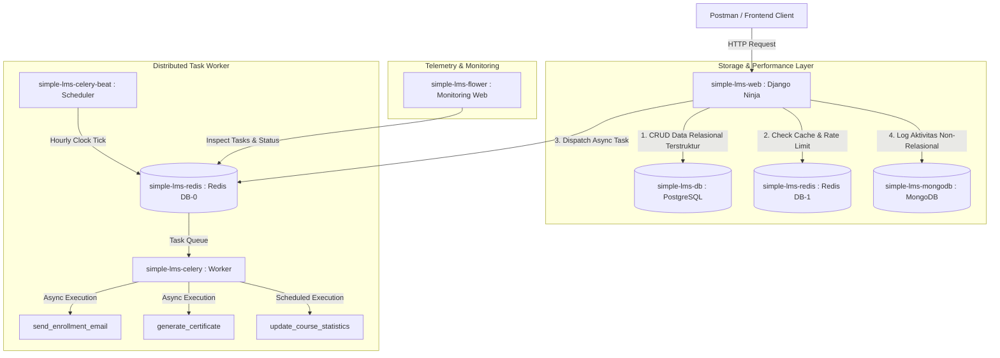
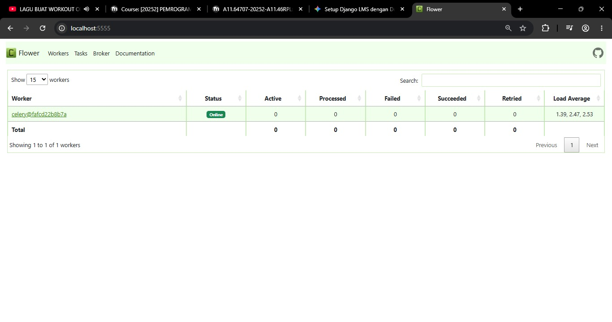
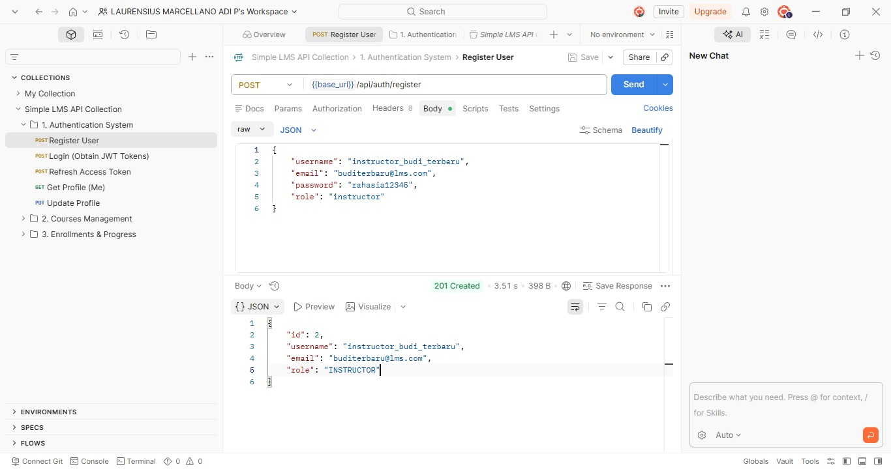
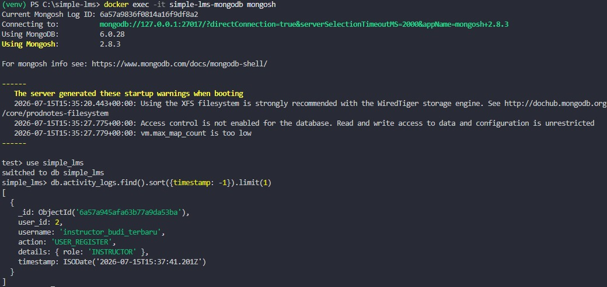

# 📚 Progress 4: Simple LMS - Advanced Features & Integration

Proyek ini adalah backend Learning Management System (LMS) yang dibangun menggunakan **Django** dan **Django Ninja**. Arsitektur sistem ini dirancang dengan pendekatan modern berbasis *micro-services lokal* menggunakan **Docker Compose** untuk memastikan skalabilitas tinggi, performa kueri optimal, serta isolasi pemrosesan tugas berat di latar belakang.

---

## 🏗️ 1. Diagram Arsitektur Sistem (Architecture Diagram)

Sistem ini membagi beban kerja ke dalam beberapa kontainer spesialis yang saling berkomunikasi di dalam jaringan internal Docker:

## 🧠 2. Penjelasan Strategi Caching & Pembatasan Akses (Caching Strategy Explanation)
A. Mekanisme Cache-Aside (Lazy Loading)
Saat endpoint daftar kelas (GET /api/courses) atau detail kelas (GET /api/courses/{id}) dipanggil oleh klien:
- Pemeriksaan Awal: Django Ninja akan memeriksa keberadaan kueri data tersebut di Redis (DB 1).
- Cache Hit: Jika kunci data ditemukan, Redis langsung mengembalikan data ke Django dalam waktu milidetik tanpa membebani database utama (PostgreSQL).
- Cache Miss: Jika data kosong atau kedaluwarsa, Django melakukan kueri langsung ke PostgreSQL, menyalin hasilnya ke memori Redis dengan parameter Time-to-Live (TTL), lalu mengirimkannya kembali ke pengguna.

B. Strategi Cache Invalidation
Untuk mencegah inkonsistensi informasi (kondisi di mana pengguna melihat data usang), digunakan strategi Write-Through/Eviction:
- Setiap kali terjadi modifikasi data melalui endpoint POST (pembuatan kelas), PUT (pembaruan kelas), atau DELETE (penghapusan kelas), fungsi backend secara otomatis mengeksekusi perintah cache.delete('course_list_key') untuk membersihkan memori usang di Redis sehingga kueri berikutnya terpaksa mengambil data paling baru dari PostgreSQL.

C. Rate Limiting Layer
- Diimplementasikan menggunakan dekorator django-ratelimit dengan pencatatan status berbasis performa tinggi di Redis.
- Setiap request dari IP unik akan dihitung. Jika frekuensi request mendadak melonjak melewati batas ambang 60 requests/minute, Redis akan memicu penolakan otomatis dan Django Ninja akan mengembalikan kode respons 429 Too Many Requests.

## 📬 3. Penjelasan Strategi Caching & Pembatasan Akses (Caching Strategy Explanation)
Seluruh komputasi berat dipisahkan dari alur utama HTTP request-response agar aplikasi web terhindar dari kendala koneksi seperti socket hang up:
- send_enrollment_email (Asinkronus):
Saat siswa melakukan registrasi atau mendaftar ke kelas, aplikasi web segera memberikan respons sukses 201 Created ke layar. Logika pengiriman pesan email dikirim sebagai pesan antrean ke Redis (DB 0) untuk kemudian dieksekusi oleh kontainer Celery Worker secara mandiri di latar belakang.
- generate_certificate (Asinkronus):
Proses kompilasi file sertifikat digital (PDF/Gambar) saat siswa menyelesaikan kelas dialihkan sepenuhnya ke pekerja Celery untuk mengisolasi penggunaan RAM besar dari server web utama.
- update_course_statistics (Scheduled / Periodic):
Kontainer Celery Beat bertindak sebagai scheduler internal. Setiap jam, kontainer ini mengirimkan sinyal pemicu otomatis agar sistem menghitung ulang agregasi statistik pendaftaran di database PostgreSQL secara berkala, alih-alih menghitungnya secara real-time setiap kali halaman diakses.
- export_course_report (Asinkronus):
Menyusun laporan data kelas berskala besar menjadi file CSV dan mengirimkannya via email/tautan unduhan tanpa menahan koneksi HTTP pengguna.

## 🛠️ 4. Panduan Pemantauan Operasional (Monitoring Guide)
Dasbor Visual Flower
Aktivitas antrean pekerja Celery dapat dipantau secara visual melalui Flower Celery Dashboard yang dapat diakses melalui peramban web (browser) pada alamat:
👉 http://localhost:5555

Perintah Cepat Redis CLI
- masuk ke dalam shell kontainer Redis:
docker exec -it simple-lms-redis redis-cli
- Memantau Data Cache (DB 1):
KEYS *
- Memantau Lalu Lintas Data Real-Time (Debugging):
MONITOR

## 📸 5. Dokumentasi Lainnya (Screenshoot)

